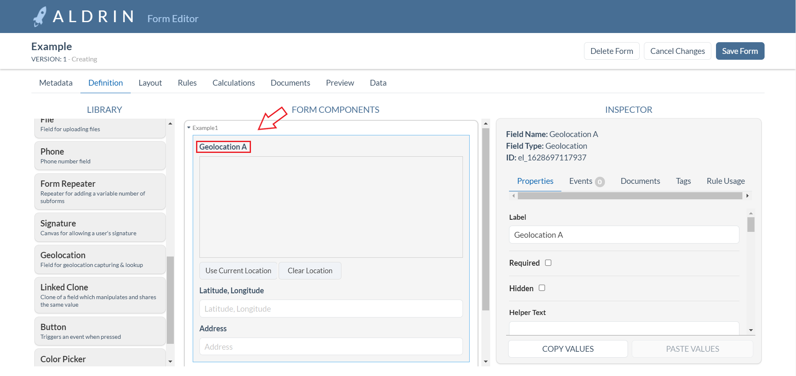
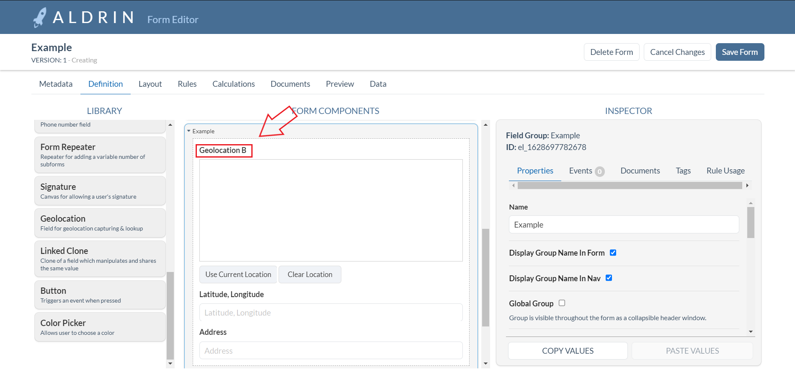
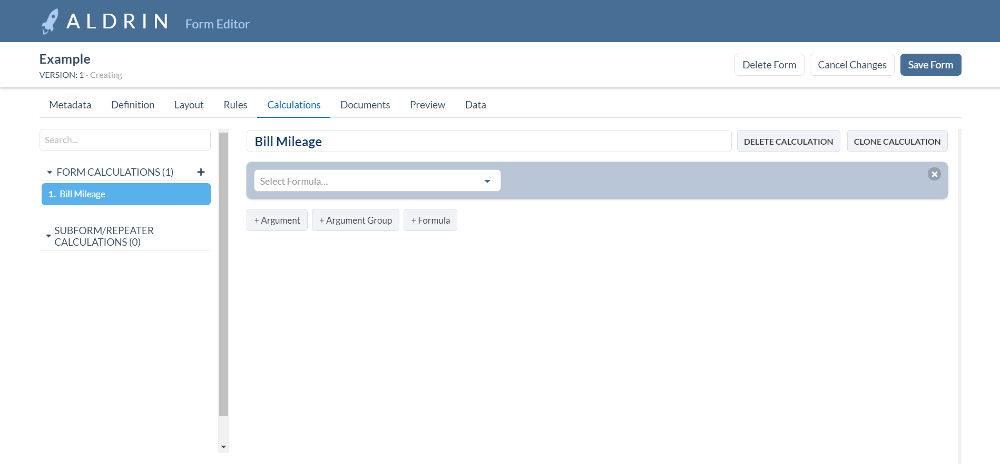
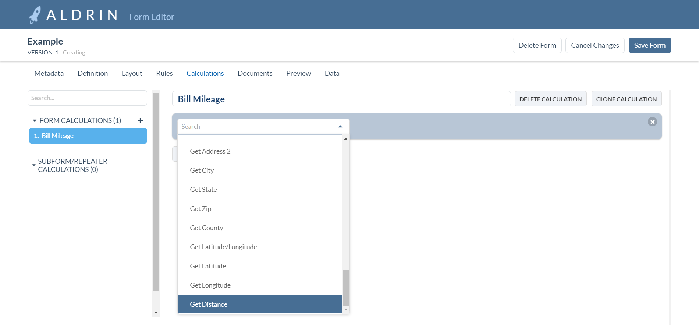
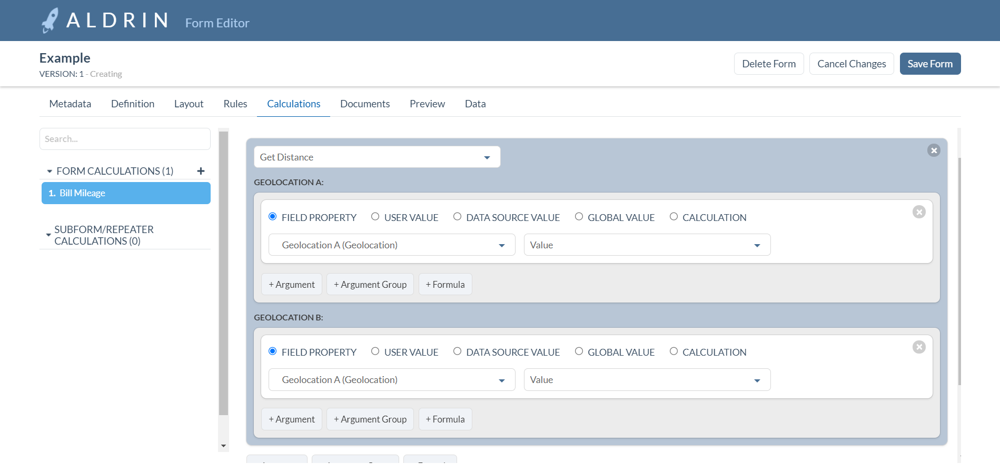
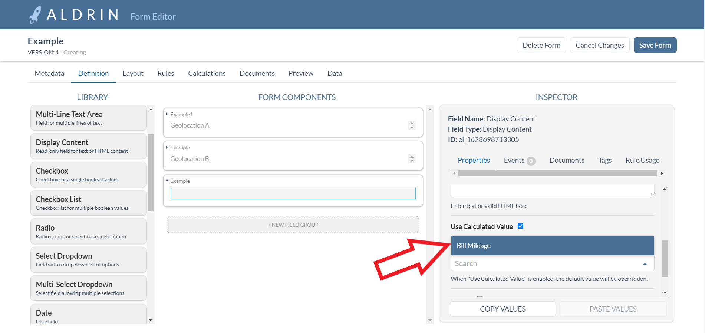
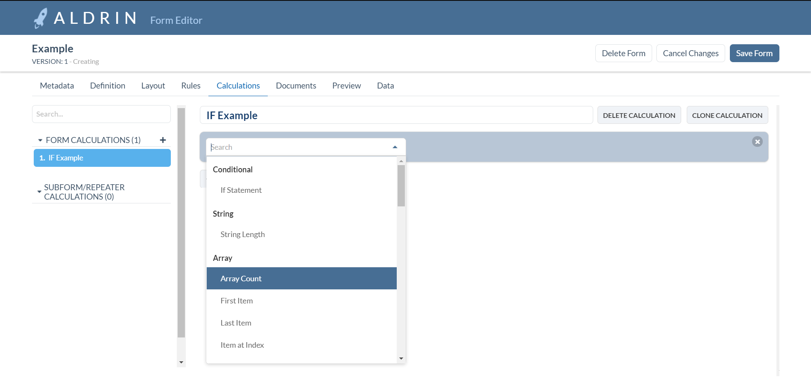

 Distance Between Two Addresses 

### First Locate the two Geolocations that will be used to calculate distance

### Then create a calculation and add a formula, Select the Get Distance option.

### Add an argument for Geolocation A and B then add specified Location Form fields and field properties

#### This formula can be used for any math operation

### Add calculation value to a field to display mileage.

 If Example 

